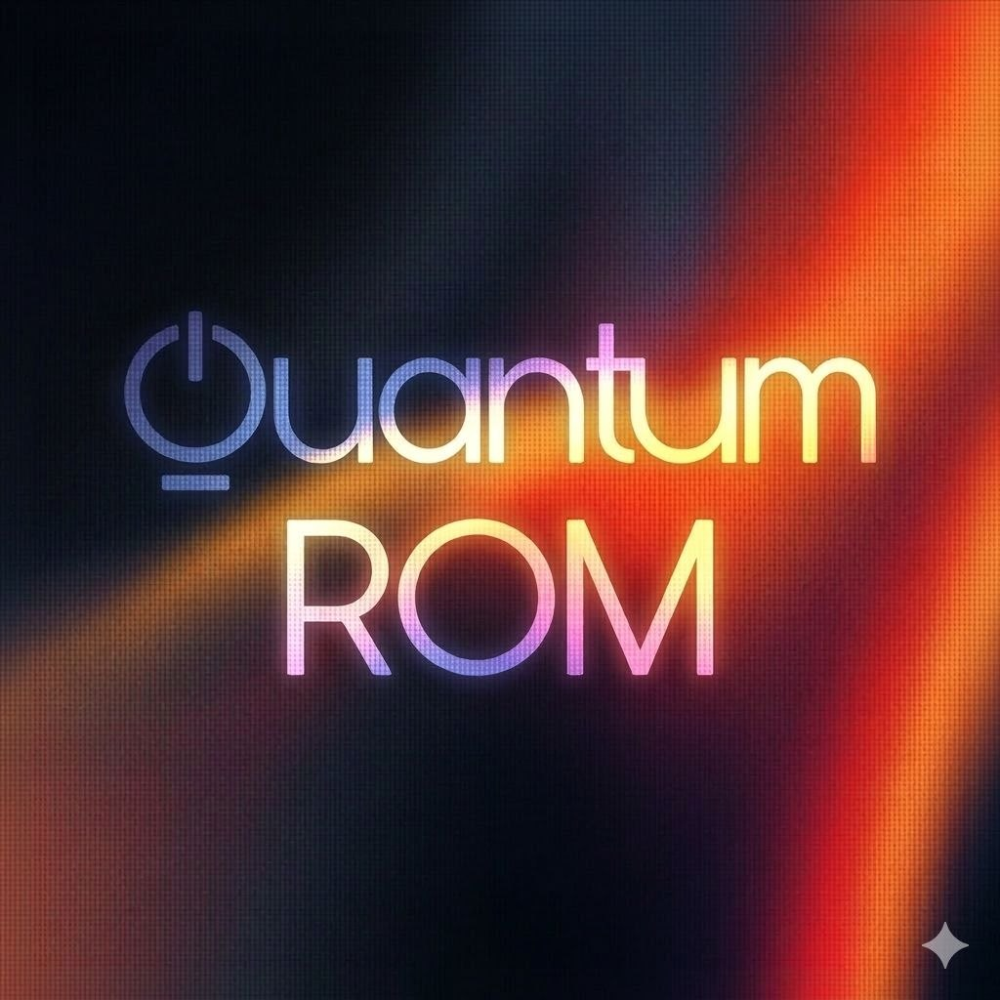

## Overview.
This Custom ROM is built by combining and refining features from multiple projects, including UNICA, Legacy-UI, and AstroRom.
- The goal of this ROM is to provide a clean, optimized, and stable One UI experience with enhanced usability and performance.

### QuantumROM Features.
- System Optimization and Performance Boost.
- UI Live Blur
- Galaxy AI enabled (Across all Galaxy Apps).
- Google photos unlimited backup.
- Full Screen Always On Display (With User Toggle).
- AOD Doze service.
- Screenshot anywhere (enabled globally).
- High End Animation.
- Extra Brightness.
- Smart Capture.
- Samsung Vision Booster.
- Palm Swipe Screenshot.
- Heavy debloated system (Keeping Essential Apps and Services).
- Improved performance and smoother UI experience.
- Optimized background processes.
- Better battery efficiency.
- Built-in Screen Recorder.
- Additional floating features enabled.
- Edge features fully working.
- Stock device conig added.
- Extra brightness support.
- Object, shadow and reflection remover support added.
- Multi user support.
- Camera privacy toggle support.
- Private share patch.
- JDM device support.
- [BluetoothLibraryPatcher](https://github.com/3arthur6/BluetoothLibraryPatcher) integrated

### Security & Privacy.
- Secure Folder support.
- Essential security components retained.
- Stable and safe daily-driver experience.

### Project Goal.
- To deliver a lightweight yet fully featured Samsung One UI ROM that balances.
- Performance.
- Stability.
- Essential Features.
- Clean User Experience.
--------------------------------------------------------------------------------
### Credits:
#### 1. Samsung Firmware Downloader.
- martinetd
- https://github.com/martinetd/samloader
- Used for downloading Samsung firmware.

#### 2. Multi Disabler.
- ianmacd
- https://github.com/ianmacd/multidisabler-samsung
- Used for disabling Samsung security and data encryption.

#### 3. Bluetooth Library Patcher.
- 3arthur6
- https://github.com/3arthur6/BluetoothLibraryPatcher
- Used for patching Samsung Bluetooth libraries.

#### 4. UN1CA Project.
- salvogiangri
- https://github.com/salvogiangri/UN1CA

#### Components Used from UN1CA.
- `HEX_PATCH` function (modified from UN1CA implementation)
- Knox Patch (from UN1CA)
- Secure Folder Patch (from UN1CA)
- Knox Guard Patch (from UN1CA)
- Secure Flag Patch (from UN1CA)
- SSRM Patch (from UN1CA)
- Some SELinux patches followed the UN1CA implementation.

#### 5. App optimization stuck fix.
- ExtremeXT
- https://github.com/ExtremeXT
- For app optimization stuck fix.

#### 6. Google photos unlimited backup.
- VehanRajintha
- https://github.com/VehanRajintha/Free-Unlimited-Google-Cloud-Backup-Magisk-Module

#### 7. ChatGPT.
- https://chat.openai.com
- For providing bash commands and bash functions according to the project requirements and instructions.

#### 8. GoFile Uploader.
- Sushrut1101
- https://github.com/Sushrut1101/GoFile-Upload

#### 9. Performnce Mods.
- rhn-1k

### Licensing.
This project is licensed under the **MIT License** - see the [LICENSE](LICENSE) file for details.
- **[android-tools](https://github.com/nmeum/android-tools)** - Licensed under Apache License 2.0
- **[apktool](https://github.com/iBotPeaches/Apktool)** - Licensed under Apache License 2.0  
- **[erofs-utils](https://github.com/sekaiacg/erofs-utils)** - Dual licensed (GPL-2.0, Apache-2.0)
- **[platform_build](https://android.googlesource.com/platform/build)** - Licensed under Apache License 2.0
- **[e2fsprogs](https://github.com/tytso/e2fsprogs)** - Licensed under GPL-2.0 / LGPL-2.1
